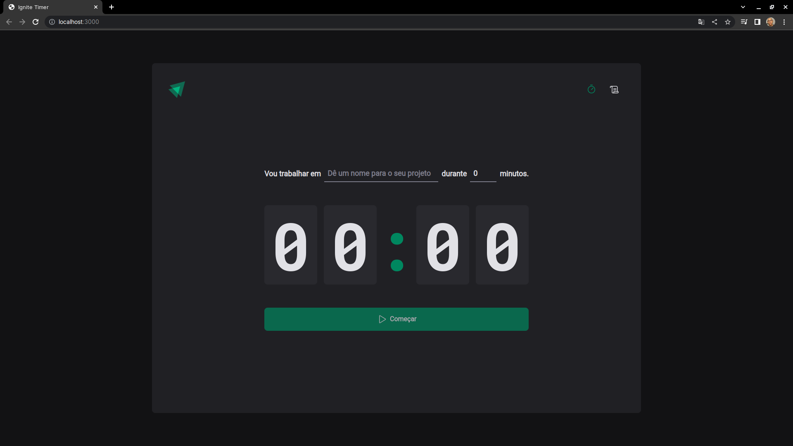

<h1 align="center">
    
</h1>

# IGNITE TIMER

Projeto tem como objetivo marcar o tempo de uma atividade de forma de decrescente possibilitando o usuário(a) verifiacar na página de histórico os ciclos que foram CONCLUIDOS ou INTERROMPIDOS.

## Aprendizados

Com a construção deste projeto, foi proporcionado a aplicação prática de conceitos de criação de Rotas com react-router-dom, formulários aplicando o react-hook-form, validação de formulário usando o ZOD, aplicação de conceitos como useEffect e contextos com o useContext.

## Rodando o Projeto

Clone o projeto

```bash
  git clone https://github.com/diego64/ignite_timer
```

Entre no diretório do projeto

```bash
  cd ignite_timer
```

Instale as dependências

```bash
  npm install
```

Inicie o servidor

```bash
  npm run dev
```